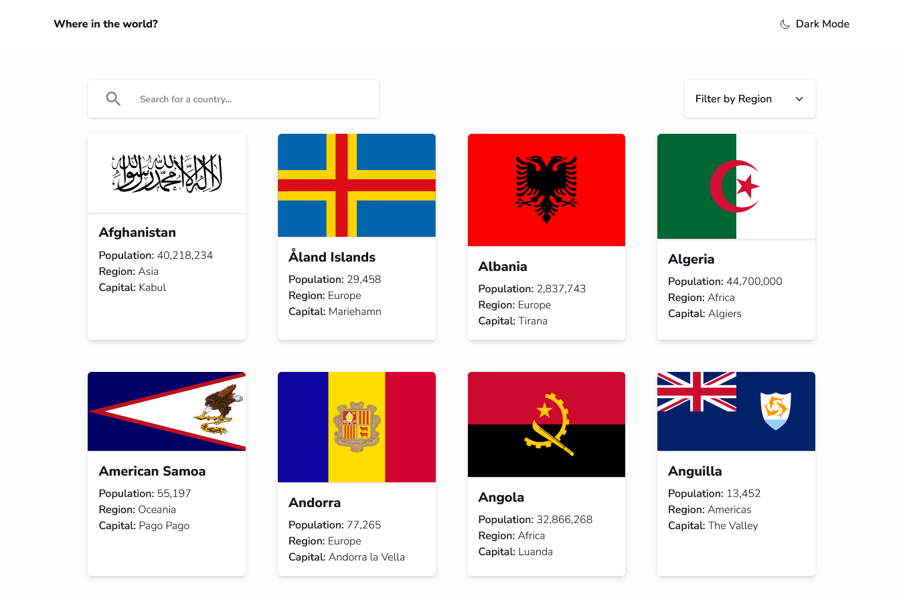

# Frontend Mentor - REST Countries API with color theme switcher solution

This is a solution to the [REST Countries API with color theme switcher challenge on Frontend Mentor](https://www.frontendmentor.io/challenges/rest-countries-api-with-color-theme-switcher-5cacc469fec04111f7b848ca). Frontend Mentor challenges help you improve your coding skills by building realistic projects.

## Table of contents

- [Overview](#overview)
  - [The challenge](#the-challenge)
  - [Screenshot](#screenshot)
  - [Links](#links)
- [My process](#my-process)
  - [Built with](#built-with)
  - [What I learned](#what-i-learned)
  - [Useful resources](#useful-resources)
- [Author](#author)

## Overview

### The challenge

Users should be able to:

- See all countries from the API on the homepage
- Search for a country using an `input` field
- Filter countries by region
- Click on a country to see more detailed information on a separate page
- Click through to the border countries on the detail page
- Toggle the color scheme between light and dark mode _(optional)_

### Screenshot

### Links

- Solution URL: [Add solution URL here](https://your-solution-url.com)
- Live Site URL: [Add live site URL here](https://your-live-site-url.com)

## My process

### Built with

- Mobile-first workflow
- [Tailwind CSS](https://tailwindcss.com) - Utility-first CSS framework
- [React](https://reactjs.org/) - JavaScript library for building UIs
- [Tanstack Query](https://tanstack.com/query/latest) - Data fetching and caching library
- [React Router](https://reactrouter.com/) - Client-side routing

### What I learned

- Use **TanStack Query** to fetch and cache server data, reducing unnecessary requests when navigating between pages.
- Build **custom hooks** (like `useCountriesQuery` and `useCountryDetail`) to keep data fetching logic separate from UI components.
- Combine **React Router** with React Query to show detail pages.
- Apply **dark mode** with Tailwind’s `dark:` variants and a theme toggler.
- Structure Tailwind classes in a **mobile-first** way for responsive layouts.

### Useful resources

- [**TanStack Query basic example**](https://tanstack.com/query/latest/docs/framework/react/examples/basic) – Helped me understand how to set up queries, caching, and refetching properly.
- [**Tailwind CSS dark mode docs**](https://tailwindcss.com/docs/dark-mode) – Showed me how to apply `dark:` variants and set up a dark theme toggler.
- [**React Router documentation**](https://reactrouter.com/) – Useful for nested routes and reading URL parameters.
- [**REST Countries API**](https://restcountries.com/) – The API used to fetch all the country data for this project.

## Author

- Website - [Muhammad Alfi Zain](https://muhammad-alfi-zain.vercel.app/)
- Frontend Mentor - [@AlfiZain](https://www.frontendmentor.io/profile/AlfiZain)
